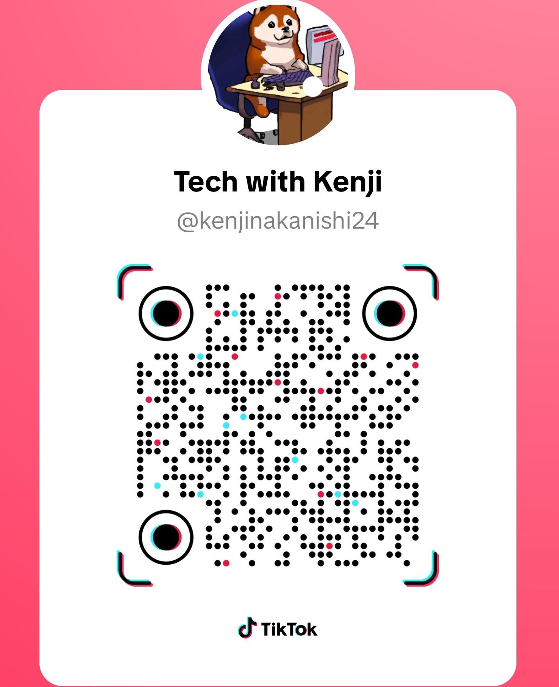

### Hi 👋 I'm Kenji Nakanishi

Currently Working on my Bachelors in Software Development

School you attend: Valencia College 
Favorite class so far: C++ programming 
**Hometown: Orlando, Florida**

**1st computer owned: Samsung Laptop**

Contact info kenjinakanishi24@gmail.com /  kcoronado3@mail.valenciacollege.edu
Favorite language:  Java, HTML, and CSS.
Any other information that helps someone get to know you!: I really like doing new projects, while currently pursing my Bachelor degree in Computer Science, I am did study Robotics and Semiconductor technician program, In the long term. I would ike to work in tech industry to enhance our live with automation using AI. 

Please follow me on the following social media: 

Kenji Nakanishi [Linkedin](https://www.linkedin.com/in/kenjinakanishi/)

Tech with Ken [Tiktok](https://www.tiktok.com/@kenjinakanishi24)

You can find my website & Resume here!

[Website LinkEase](https://kenjisan624.github.io/Link-Ease/) 

[Download my resume (PDF)](resume.pdf) 

<!--
Here are some ideas to get you started:

- 🔭 I’m currently working on ...
- 🌱 I’m currently learning ...
- 👯 I’m looking to collaborate on ...
- 🤔 I’m looking for help with ...
- 💬 Ask me about ...
- 📫 How to reach me: ...
- 😄 Pronouns: ...
- ⚡ Fun fact: ...
-->
